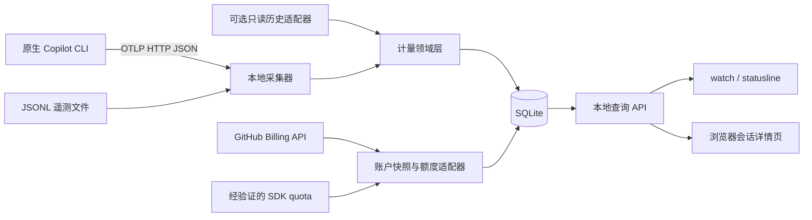

# PilotMeter：npm 包具体实现方案

> 更新：2026-09-28  
> 项目：`C:\workspace\PilotMeter`  
> 交付状态：本文件保留设计依据；核心实现已交付为 `0.1.0-preview.4` 本地预览版，分阶段证据见 [实施记录](progress.md)。真实账户对账尚未通过，npm 尚未公开发布。
> 已确认的使用方式：GitHub Copilot CLI / 终端，常驻显示用量提示，点击链接打开会话消耗详情页。

## 1. 方案结论

**将 PilotMeter 做成一个 npm 分发的本地工具：一个命令行入口、一个后台采集服务、一份本地数据库、一套浏览器详情页。** 不需要独立云服务，也不需要 Electron。

推荐的日常流程：

1. 用户通过 npm 安装 PilotMeter。
2. 使用 `pilotmeter run -- <Copilot 参数>` 启动原生 Copilot CLI；PilotMeter 自动准备本地采集服务，并仅为这个子进程配置遥测。
3. 用户在独立终端运行 `pilotmeter watch`，或选择将提示接入 Copilot 的自定义状态栏。
4. 终端显示清楚标注来源的用量和百分比；点击支持的终端链接，或按 `o`，打开本地详情页。
5. 页面按会话展示已记录的 AI Credits、调用轮次、时间、模型信息、完整性和数据来源。

必须保留原始目标：**官方月度额度使用率 + 各会话 Credits 明细**。其中，官方百分比有独立的数据验证门槛。不能用“本机消耗 / 自定义预算”替代它后，声称已经实现官方套餐进度。

### 1.1 当前项目基线

实际检查结果：项目是 Git 仓库，当前位于 `main`；初始化提交为 `7814ee8`。原有文件为 `README.md`、`.gitignore`、`LICENSE`，许可证为 MIT，尚无 `package.json` 或业务代码。

本方案沿用项目名 **PilotMeter**。npm 包名和命令暂定 `pilotmeter`；包名可用性、发布账号及 scope 在发布前确认。之前讨论过的 PilotPulse 不作为本方案的默认名称。

### 1.2 需求与范围

| 需求 | 设计决策 | 完成证据 |
| --- | --- | --- |
| 用 npm 安装 | 编译好的 CLI、服务端和静态页面一起打包 | 在干净环境安装 `.tgz` 后可运行，无开发工具依赖 |
| 终端常驻提示 | 独立 `watch`；可选原生 `statusLine` 接入 | 指定终端内持续更新，不干扰 Copilot 的交互界面 |
| 显示用了百分之多少 | 官方额度和自定义预算采用不同模式、不同标签 | 分子、分母、单位、周期和范围都得到验证 |
| 点击打开详情 | 支持时输出 OSC 8 链接，同时提供普通 URL、`o` 快捷键、`open` 命令 | 在支持矩阵内完成真实点击测试 |
| 各会话消耗 | 原生 CLI OpenTelemetry 采集；旧历史可选补齐 | 与同一会话的 `/usage` 核对，不重复计费 |
| 轻量、本地运行 | Node.js 服务 + SQLite + 静态页面 | 默认只监听 loopback，不要求云端账号或远程数据库 |

首版优先 Windows；模块按跨平台方式组织。macOS / Linux 必须通过安装、进程和链接测试后再声明支持。系统托盘、桌面浮窗、IDE 全覆盖、跨设备同步不在本轮终端版范围内。

## 2. 必须先做的数据验证

已有官方能力可以支撑实现，但“公开文档有字段”不等于“每一种订阅都适用”。建议先用 1–2 人日完成下列验证，形成可复用的脱敏测试样本。

| 验证项 | 操作 | 通过条件 | 不通过时 |
| --- | --- | --- | --- |
| CLI 会话计量 | 同一会话执行普通请求、切模型、包含子代理的任务，采集遥测并查看 `/usage` | 顶层调用累计值与原生 AIC 展示在显示精度内一致 | 保留原始 nano AIU，标记单位未确认 |
| 官方月度额度 | 查询选定 SDK 版本的 quota，并对照 GitHub 页面 | 明确其额度池、单位、周期、包含额度与已用比例 | 官方百分比保持不可用，不能改用默认套餐常量 |
| 账单产品覆盖 | 查询 Billing API，对照该账户实际账单和适用产品 | 明确哪些产品属于同一额度池，以及 gross/discount/net 的含义 | 只展示已识别产品用量，不称全账户总量 |
| 权限和付费主体 | 确认个人直付或组织/企业承担费用 | 使用正确主体的端点且有最小只读权限 | 显示未连接或权限不足，不显示 0% |
| 终端点击 | 在 Windows Terminal 等目标环境测试普通链接、OSC 8、Copilot 状态栏输出 | 支持范围有实际记录，降级入口可用 | 提供普通 URL、`o` 和 `pilotmeter open` |
| 原生状态栏 | 通过当前 CLI 版本的 `settings.json` 配置运行脚本 | 正确获取 stdout、不显示错误日志、不影响 TUI | 保留独立 `watch` 作为可用入口 |

验证应固定并记录 Copilot CLI、SDK、Node.js、终端版本。调研时 CLI 最新稳定版为 `1.0.88`，SDK 已核查版本为 `1.0.14`；这是验证起点，不代表这些版本对所有组合自动兼容。[S1][S2][S3]

## 3. 三种用量模式

### 3.1 官方额度模式：原始目标

显示示例：

```text
PilotMeter  本月官方额度已用 42.0%  ·  已采集 12 个会话  ·  查看详情 ↗
```

启用前必须证明：

- 分子、分母属于同一用户或计费主体、同一额度池、同一计费模式。
- 单位是已验证的 AI Credits，或明确标注的 legacy Premium Requests。
- 周期一致，并取得当前真实额度；适用的 base / flex、升级或预算调整得到处理。
- 若来自多个 Billing 产品，已验证这些产品的完整覆盖与归属。
- 若直接使用 quota 的 `remainingPercentage`，已验证它代表所展示的额度，而不是会话/周限额或其他请求配额。

当上述条件缺失时，显示“官方额度未确认”，并继续展示可用的消费量。官方总量不能由本机会话求和代替。

### 3.2 自定义预算模式：独立可用功能

用户明确设置预算后显示：

```text
PilotMeter  自定义预算已用 42.0%  ·  本机已记录 630 / 1,500 Credits  ↗
```

必须同时标出分子的来源：本机已记录会话，或已经识别范围的账单产品。两者不能无提示切换。

该模式适合先交付预览版，但不能作为“官方额度百分比已完成”的证据。

### 3.3 仅用量模式：安全默认值

未确认分母、未设置预算时：

```text
PilotMeter  本机已记录 126.40 Credits  ·  官方额度未确认  ↗
```

如果 nano AIU 与 Credits 的换算尚未验证，则显示原始单位或“计量单位待确认”，不伪造 Credits。

### 3.4 统一显示规则

- 数据未知、接口无权限、历史未采集、无限额度，均不显示虚构的 0%。
- 分母为 0 时显示“预算为 0”，不执行除法；无限额显示“无固定上限”。
- 实际用量超过额度时允许显示 105% 等真实比例，视觉进度条最多填满，超出部分单列。
- 区分“上下文占用率”“会话/周限额”“月度额度”。`session.usage_info` 的 token 百分比不是账单百分比。
- 明确更新时间：抓取时间不等于 GitHub 数据的实际截止时间。

## 4. 技术栈与 npm 打包

| 层 | 首选方案 | 原因 / 约束 |
| --- | --- | --- |
| 运行时 | Node.js 24 LTS，首批验证基线 24.14+ | 与本机环境一致；减少旧运行时兼容分支 |
| 语言 | TypeScript，编译为 ESM | 统一定义事件、额度和接口的数据类型 |
| CLI | Commander | 管理参数、帮助、退出码和子命令 |
| 服务端 | Node 原生 HTTP | 路由数量少，不需要完整业务框架 |
| 存储 | `node:sqlite`，封装在 repository 层 | 不需要安装原生 npm 扩展；支持事务、去重和迁移 |
| 页面 | HTML + CSS + TypeScript，Vite 仅用于构建 | 无需 React 即可完成轻量仪表页；生产环境不运行开发服务器 |
| CLI 子进程 | 成熟的跨平台 spawn 封装 | Windows npm `.cmd` 与原生可执行文件需要不同处理 |
| JSONC 配置 | `jsonc-parser` 的局部编辑能力 | 保留 Copilot 设置注释及不相关字段 |
| 精度 | nano 单位使用 `BigInt`；十进制账单量用定点/decimal 类型 | 避免累计时发生浮点误差 |
| 测试 | `node:test` + 浏览器交互测试 | 覆盖计量逻辑、进程、打包安装和页面 |

**SQLite 的已知风险：**本机 Node `24.14.0` 的 `node:sqlite` 可正常执行查询，但仍发出 experimental 警告。因此首版固定验证范围、将数据库访问限制在后台进程，并隔离 repository 接口。若项目要求不依赖实验接口，可在该接口下改用 `better-sqlite3`，同时补测原生依赖的安装兼容性。这是明确的选型取舍，不能把内置 API 描述成已经稳定。

### 4.1 包内容

```text
PilotMeter/
├─ package.json
├─ package-lock.json
├─ tsconfig.json
├─ bin/
│  └─ pilotmeter.js             # 带 shebang 的极薄入口
├─ src/
│  ├─ cli/                     # 命令、终端输出、状态栏和浏览器启动
│  ├─ daemon/                  # 单实例、HTTP、调度、进程生命周期
│  ├─ collectors/              # OTLP JSON、JSONL 导入、可选历史采集
│  ├─ providers/               # Billing、quota、身份与能力探测
│  ├─ domain/                  # 计量单位、周期、范围、百分比、对账
│  ├─ storage/                 # SQLite、迁移、事务和查询
│  └─ shared/                  # 公共类型、schema、脱敏和错误码
├─ web/                        # 页面源码
├─ dist/                       # npm 包内的已编译 CLI / 服务
├─ public/                     # npm 包内的已构建页面
├─ test/
│  ├─ fixtures/                # 脱敏遥测和官方响应样本
│  ├─ unit/
│  ├─ integration/
│  └─ e2e/
└─ docs/
   ├─ implementation-plan.md
   └─ compatibility.md         # 后续记录实际通过的环境组合
```

`package.json` 的拟议关键项：

```json
{
  "name": "pilotmeter",
  "version": "0.1.0",
  "type": "module",
  "license": "MIT",
  "engines": { "node": ">=24.14.0" },
  "bin": { "pilotmeter": "bin/pilotmeter.js" },
  "files": ["bin", "dist", "public", "README.md", "LICENSE"],
  "scripts": {
    "build": "tsc && vite build",
    "test": "node --test",
    "prepack": "npm run build"
  }
}
```

这是结构示例，具体输出目录与测试脚本在实现时配置。`engines` 定义最低门槛，不等于所有未来 Node 版本已通过兼容测试。首批 CI 以 Node 24 为主。

不设置会自动启动服务、修改用户配置或下载 Copilot 的 `postinstall`。GitHub Copilot CLI 由用户独立安装和登录；普通安装不包含 Electron，也不强制安装实验性 SDK 适配器。

## 5. 命令设计与使用流程

**以下命令为方案接口；当前实现、参数和能力边界以 [README](../README.md) 为准，npm 尚未公开发布。**

### 5.1 最小命令表

| 命令 | 职责 | 副作用 |
| --- | --- | --- |
| `pilotmeter doctor` | 检查 Node、Copilot、终端、端口和数据能力 | 只读，不扫描对话正文或输出凭据 |
| `pilotmeter start [--background] [--open]` | 启动服务；默认前台便于诊断 | 创建应用数据目录和数据库 |
| `pilotmeter run -- <args>` | 确保服务就绪，再启动原生 Copilot | 仅为子进程设置遥测环境；传递原始参数 |
| `pilotmeter watch` | 在独立终端持续显示用量；`o` 打开页面，`q` 退出观察 | 不退出 Copilot，也不默认停止服务 |
| `pilotmeter status [--json]` | 输出一次当前状态，便于脚本调用 | 不发起模型调用 |
| `pilotmeter statusline` | 快速输出一行，供原生状态栏调用 | 只读本地缓存，超时快速降级 |
| `pilotmeter open` | 打开当前本地详情页 | 启动系统浏览器 |
| `pilotmeter init --statusline` | 安装可选状态栏桥接脚本并最小修改设置 | 有备份及变更清单，可恢复 |
| `pilotmeter config set budget.monthlyCredits <值>` | 设置用户自定义月度预算 | 明确记为 custom，不冒充官方 allowance |
| `pilotmeter import <文件>` | 导入受支持的 CLI JSONL 遥测 | 经相同去重账本写入，返回导入统计 |
| `pilotmeter stop` | 请求 PilotMeter 服务正常退出 | 不杀 Copilot 进程，不删除用量数据库 |
| `pilotmeter demo` | 启动演示数据页面 | 独立数据目录，处处标明虚构数据 |

账户连接和历史补齐在 provider 验证后增加：

```text
pilotmeter account connect --user <username>
pilotmeter account disconnect
pilotmeter history import
pilotmeter init --restore-statusline
```

账户连接只绑定身份、计费主体和凭据来源，不在命令行参数中接收明文 token。初版可使用专用环境变量 `PILOTMETER_GITHUB_TOKEN`；后续增加系统凭据库适配。不会自动读取 Copilot 内部认证文件。

### 5.2 安装后的目标体验

```sh
# 开发阶段先安装本地打包产物；这份方案没有生成该包
npm install -g ./pilotmeter-0.1.0.tgz

pilotmeter doctor
pilotmeter run

# 在另一个终端或分屏中
pilotmeter watch
```

公开发布、确认名称归属后，才提供 `npm install -g pilotmeter` / `npx pilotmeter` 的正式安装说明。不得将未发布名称写成当前可直接使用的安装指令。

### 5.3 不干扰原生 CLI 的原则

`run` 使用继承 stdio 的子进程。Copilot 正在运行时，PilotMeter 不向同一屏幕持续重绘状态，否则可能破坏 Copilot 的 TUI。

- 独立 `watch` 可以刷新自己的终端区域。
- 同一 Copilot 界面的常驻提示通过 `statusLine` 实现。
- `statusline` 不做网络账单查询、不扫描全部历史、不加载大型 SDK；只读取小型本地快照。
- `statusline` stdout 只输出状态文本，日志进入后台日志或 stderr，避免污染状态栏。

### 5.4 点击和键盘兼容

优先输出 OSC 8 超链接；不支持时输出普通 `http://127.0.0.1:<port>/`。终端可能要求 Ctrl+点击或 Cmd+点击，因此文案不承诺所有平台都可以直接单击。

`watch` 的 `o` 键和 `pilotmeter open` 始终作为备用入口。不能因为 Windows Terminal 支持 OSC 8，就推断 Copilot 的自定义状态栏渲染器一定保留链接；两层分别测试。[S1][S4]

## 6. 原生 Copilot 配置接入

当前官方文档将用户设置放在 `~/.copilot/settings.json`，支持 JSONC；`COPILOT_HOME` 可以改变整个配置目录。`config.json` 主要是 CLI 自动管理的内部状态，可能包含认证信息，不应将它作为 PilotMeter 的设置修改目标。[S4]

### 6.1 状态栏安装

`init --statusline` 按以下步骤执行：

1. 检测受支持的 CLI 版本和真实配置位置，包括 `COPILOT_HOME`。
2. 读取用户设置，检查是否已存在自定义 `statusLine`、项目级覆盖或符号链接。
3. 在 PilotMeter 数据目录生成平台桥接脚本，绑定实际 Node 路径与包入口。持久接入使用全局安装或固定安装目录，不把临时 `npx` 缓存路径写成长期依赖；升级后重新核验桥接路径。
4. 用 JSONC 局部编辑，仅修改受支持的 `statusLine` 字段及必要的 `footer.showCustom`；保留注释、格式和无关设置。
5. 保存原字段、原文件摘要与备份位置，便于恢复；写入前重新核对摘要，避免覆盖并发修改。
6. 原设置已有状态栏时不直接覆盖：给出可审阅的替换方案，只有显式选择替换才写入。

撤销时，只恢复仍与 PilotMeter 写入值一致的字段；保留用户后来修改的内容并报告冲突，不能整文件还原旧备份。若设置文件是符号链接，应更新其目标，不把链接替换成普通文件。

拟议配置形态：

```jsonc
{
  "statusLine": {
    "type": "command",
    "command": "<PilotMeter 生成的桥接脚本绝对路径>",
    "refreshInterval": 5
  },
  "footer": { "showCustom": true }
}
```

路径转义、Windows `.cmd` 执行、stdin session JSON、stdout 长度与 ANSI 支持，都列入兼容测试。已有项目设置覆盖用户设置时，`doctor` 解释实际生效层级，不擅自修改仓库配置。

### 6.2 遥测配置

默认由 `run` 给 Copilot 子进程注入本地 exporter 设置，不永久编辑 shell profile：

```text
OTEL_EXPORTER_OTLP_ENDPOINT=http://127.0.0.1:<collector-port>
OTEL_EXPORTER_OTLP_PROTOCOL=http/json
COPILOT_OTEL_EXPORTER_TYPE=otlp-http
OTEL_INSTRUMENTATION_GENAI_CAPTURE_MESSAGE_CONTENT=false
```

接收端鉴权通过仅用于本机 collector 的随机令牌及 OTLP headers 传递，令牌不打印到终端。需要同时处理 traces / metrics / logs 专用 endpoint 或 protocol 覆盖变量，以免部分数据仍发往原来的端点。

如果用户已有企业或个人 exporter 配置，默认报告冲突，不静默替换；可以显式选择仅本次子进程使用 PilotMeter，或让现有 collector 转发。PilotMeter 不改变组织管理策略。[S1]

## 7. 总体架构



将模块分成三条独立数据线：

1. **事件账本**：保存已观测的真实调用数据，负责会话归因和幂等。
2. **账户快照**：保存官方账单 / quota 及其范围，负责账户用量与额度。
3. **展示模型**：根据单位、范围、完整性和时效判断哪些值可比较、能否计算百分比。

账户快照不会覆写本地原始调用；本机会话与云端账单出现差额时保留差异，不强行调平。

采集身份也需要验证：OTel 的会话 ID 不能证明它属于某个 GitHub 账户。由受支持的只读身份能力或用户显式绑定建立 `source_context`；无法验证时标记身份未确认，不自动与个人账单对账。账户切换或 `COPILOT_HOME` 改变时建立新的上下文。

## 8. 会话采集与计量规则

### 8.1 主通路：OTLP HTTP JSON

首版实现 `/v1/traces` 的 OTLP JSON 解析。按 OTLP 层级读取 resource、scope、span 和 AnyValue 属性，而不是只匹配某个示例的扁平 JSON。协议响应遵循 OTLP 规范；有效数据持久化后才确认，格式错误或不支持的编码不能返回虚假的成功。

CLI 可能同时导出 metrics / logs。对选定版本确认请求行为后，为不用的信号配置关闭或提供符合协议的接收处理；不能让控制台不断出现 404 重试。首版不宣称支持 protobuf；将 exporter 明确设为 JSON，并对错误 Content-Type 返回清晰诊断。

需要的核心字段：[S1]

| 字段 | 用途 |
| --- | --- |
| `gen_ai.operation.name` | 识别 `invoke_agent` / `chat` |
| `gen_ai.conversation.id` | 归属会话 |
| `github.copilot.nano_aiu` | 原始用量计量 |
| `traceId`、`spanId`、父 span 标识 | 去重、祖先判定 |
| `startTimeUnixNano`、`endTimeUnixNano` | 调用时间和月度归属 |
| `server.address`、`server.port` | 当前文档中的顶层调用辅助标识 |
| 模型、token、`service.version` | 详情、排错和版本适配 |

### 8.2 防止重复计量

官方说明要求仅累计 root `invoke_agent` 的 `nano_aiu`。子 `chat` 以及子代理也可能带有成本，不可全部相加。[S1]

实现规则：

1. 对当前已核查的 CLI 版本，要求操作为 `invoke_agent`、同时具有合法的 `server.address` 和 `server.port`，并且不存在已知的 `invoke_agent` 祖先。后续版本的条件通过能力验证后更新，不能盲目沿用。
2. 不把“本批次找不到父节点”当成顶层证据。父子可能跨批次、乱序到达，顶层调用也可能有外部分布式 trace 父节点。
3. 缺少足够证据时先进入待分类/诊断状态，不直接计入总额。待分类超时只能转为诊断，不能自动升级为 root；后到的祖先或冲突记录若推翻已计量分类，隔离该事件并事务性重算受影响的聚合，保留修正记录。
4. 同一数据库内原始 `traceId + spanId` 具有全库唯一约束；采集设备、入口、sourceInstance 和账户作为归属元数据，不参与会随配置变化的事件身份。重复投递不增加用量。
5. 相同 ID、相同内容为重放；相同 ID、不同成本或归属为冲突，隔离诊断，不能静默覆盖或再次累加。
6. 模型分项可读取 `chat` 明细并核对顶层总额，不能用主代理的 model 字段代表全部子代理的模型分摊。

OTLP 与 JSONL 使用同一 ID 规范化规则；文件移动、重启、不同导入入口，以及账户身份从未知补全，都不能改变幂等键。分类表与事件表使用相同身份规则。`sourceInstance` 只描述采集源，不是新的计费命名空间。

### 8.3 精度与未知值

- nano AIU 用非负整数字符串持久化，领域层通过 `BigInt` 累加。
- 缺失、负数、非安全整数、非法小数或不支持的编码进入未知/异常状态，不能变为 0。
- 保留原始单位和 runtime 版本。SDK 示例用 `totalNanoAiu / 1e9`，但要求与当前计费规则核验；验证后才展示为 AI Credits。[S2]
- `github.copilot.cost` / `assistant.usage.cost` 是旧请求倍率，不是 Credits 或美元。
- 只有展示时舍入；若部分调用未知，标注“已知用量小计 + 未知调用数”。

### 8.4 时间归属

按顶层调用的 `endTime` 归属 UTC 月份，采用半开区间 `[月初, 下月月初)`。这是本地观测账本的归属规则，需在对账时承认它可能与平台最终入账时间不同。

会话可能跨月，因此列表显示“本月已记录消耗”，详情同时可展示生命周期累计。北京时间每月 1 日 08:00 对应 UTC 月初；不能按订阅扣费日推算额度周期。[S5]

### 8.5 文件导入与历史补齐

JSONL 文件导入必须经过同一标准化和幂等写入流程。增量读取记录文件身份、代次和字节偏移；只处理完整行，并在同一事务内保存事件和 checkpoint。测试半行、UTF-8 跨块、截断、轮转、崩溃重读。

历史会话可选使用 SDK `sessions.readPersistedEvents`，该接口能只读本地持久化 journal，不创建、恢复或激活用户会话。相关接口和字段仍为 experimental，使用独立适配器并固定版本。[S3]

- `session.usage_checkpoint` / shutdown 中的成本是累计快照，不把所有 checkpoint 相加。
- 当月计量默认以可定位时间的 OTel 事件为主；历史 checkpoint 作为对应会话 journal generation 的独立累计快照，标出“历史累计截至何时”，不能覆盖或相加到当月已观测量。
- 生命周期视图可以选择最新有效历史累计或 OTel 已观测累计作为主来源，但必须保存来源、generation 和覆盖状态；切换来源不会改变原始账本，也不能把两者差额自动生成一条费用事件。
- 如果要计算“历史基线 + 后续 OTel”，必须找到可验证的事件水位或 ID 映射，证明两个区间不重叠且连续；仅有 checkpoint 时间不够。没有可靠边界时，分开展示历史累计和启用后的已观测量，不给出伪完整总和。
- 没有成本字段的旧会话显示未知，不按消息条数推算“精确费用”。
- 只有生命周期累计、没有时间定位的历史，不能全部归入导入当月。
- SDK attach 不等于能附着任意正在运行的终端 CLI，监控器不抢占或恢复用户活动会话。

## 9. 账户额度与账单适配

### 9.1 端点按计费主体分开

| 主体 | 公开用量端点 | 接入范围 |
| --- | --- | --- |
| 个人直接付费 | `/users/{username}/settings/billing/ai_credit/usage` | 首个实现目标，须确认个人直付 |
| 组织付费 | `/organizations/{org}/settings/billing/ai_credit/usage` | 后续管理员适配，不假定普通成员有权限 |
| 企业付费 | `/enterprises/{enterprise}/settings/billing/ai_credit/usage` | 后续独立鉴权和企业角色适配 |

个人端点不包含组织或企业承担的许可证消费。公司用户在个人接口拿到空列表，不能解读为消费为零。[S6][S7]

当前端点参考列出个人细粒度 token 的 `Plan: read`，组织为相应 `Administration: read` 与管理员要求；企业另有 token 类型和 billing 权限要求。实现时按所选端点确认，不能把个人 token 流程机械复用到所有主体。部分通用教程仍有旧权限说明，以具体端点参考加真实调用验证为准。

### 9.2 用量映射

已核查的官方响应示例包含：

```text
product       = Copilot AI Credits
sku           = AI Credit
unitType      = ai-credits
grossQuantity = 100
```

可以把该组合建立为首个明确适配规则，但仍需实际核对 gross / discount / net 在套餐抵扣、自动选模折扣和额外消费下的含义。[S6]

- `netAmount = 0` 不代表没有消耗，可能只是被包含额度覆盖。
- 未知单位或 SKU 返回 unsupported，不按价格或美元倒推 Credits。
- 校验返回用户名/主体、year、month 和筛选条件；年汇总或单日/单模型结果不能当成完整月统计。
- 空 `usageItems` 记为“报告无条目”。只有身份、范围和计费归属都已确认，才能解释为该范围内的零。
- 相同单位不代表相同额度池。Spark 等功能可能使用 AI Credits；只识别 Copilot 产品时，不能宣称得到整个套餐额度池的完整消耗。[S5]

### 9.3 quota 与官方百分比

Billing REST 响应未提供完整 allowance。SDK `account.getQuota` 有 `remainingPercentage`、`entitlementRequests`、`usedRequests`、`resetDate` 等，但字段命名与示例仍涉及 `premium_interactions`，且生成接口标记 experimental。[S2][S3]

因此 quota provider 必须返回能力结论：是否识别计费类型、是否证明月度 AI Credit 池、是否证明分母、是否已与官方页面核对。仅仅能返回一个百分比，不足以开启“本月官方额度已用”。

公司 Credits 可能是共享池；个人 user-level budget 也是独立限制。不能把每个席位向池贡献的 Credits 当作该用户的独享上限。[S8]

### 9.4 最小领域类型

```ts
type UsageSnapshot = {
  source: 'billing-rest' | 'sdk-quota' | 'local-otel';
  billingEntity: string;
  usageSubject: string;
  poolId: string | null;
  products: string[];
  periodStart: string;
  periodEnd: string;
  billingMode: 'ai-credits' | 'premium-requests' | 'unknown';
  unit: string;
  used: string | null; // 十进制定点字符串，非展示用浮点数
  coverage: 'complete' | 'partial' | 'unknown';
  state: 'known' | 'empty' | 'unknown' | 'unsupported';
  limit: string | null;
  limitKind: 'official' | 'manual-official' | 'custom' | 'unlimited' | 'unknown';
  verifiedAt: string | null;
  fetchedAt: string;
  providerUpdatedAt: string | null;
  stale: boolean;
  lastError: { code: string; message: string } | null;
};
```

百分比由该类型推导，不把无法证明的数值存成默认 0。若用户手动核实官方当月额度，记录核实时间和周期；这也不能弥补分子覆盖不完整。

### 9.5 刷新和对账

- 本地完成调用后更新；浏览器通过 SSE 或短轮询刷新，SSE 断线后用 snapshot 恢复。
- 账单默认每 5 分钟刷新，空闲时 15 分钟；这是产品建议，不是 GitHub 更新时效保证。
- 手动刷新去重、节流。限流遵守响应中的重试提示并退避；普通权限错误不循环重试。
- 失败保留旧快照并标陈旧；月初不拿旧月数据当新月用量，也不先闪现一个未验证的 0%。
- 只有账户、池、单位、周期、产品范围和时间覆盖可比时才对账。
- 正差额可标“暂未归属”，不能断言全来自其他设备；负差额标“尚未对齐”。没有官方更新水位时，对账始终标明时间限制。

## 10. 数据库与应用目录

### 10.1 运行数据不放进 Git 仓库

建议默认位置：

| 平台 | 数据目录 |
| --- | --- |
| Windows | `%LOCALAPPDATA%\PilotMeter` |
| macOS | `~/Library/Application Support/PilotMeter` |
| Linux | `$XDG_STATE_HOME/pilotmeter`，缺省 `~/.local/state/pilotmeter` |

支持 `--data-dir`，便于测试、便携部署和环境隔离。`demo` 始终使用独立子目录，不能给真实账本追加虚构消费。

### 10.2 表设计

| 表 | 关键字段 / 索引 | 用途 |
| --- | --- | --- |
| `source_contexts` | source、device、account、COPILOT_HOME 摘要 | 避免多账号、多配置目录混算 |
| `usage_events` | trace/span 全库唯一键；source 归属；session、end_at 索引；nano_aiu TEXT 可空 | 顶层调用账本 |
| `span_classification` | 与事件表一致的 trace/span 身份、parent、类型、判定状态、过期时间 | 跨批次祖先判断和待分类诊断 |
| `sessions` | source/session 唯一键、首次/最后观测时间、别名 | 会话元数据，标题不依赖 prompt 正文 |
| `usage_checkpoints` | source/session/generation、累计值、边界时间 | 可选历史补齐与对账 |
| `account_snapshots` | billingEntity/pool/period/source、完整性、抓取时间 | 官方账户快照 |
| `budget_settings` | 预算类型、周期、范围、值、核实时间 | 官方/手动/自定义严格区分 |
| `import_cursors` | 文件身份、代次、byte offset | 可重放、可恢复的文件导入 |
| `diagnostics` | 错误码、脱敏摘要、时间、计数 | 未知单位、冲突事件、连接错误 |
| `schema_migrations` | migration version | 可控升级与回滚诊断 |

SQLite 使用事务、唯一约束和 WAL。事件入库与导入游标更新要原子完成；nano 数字以 TEXT 保存，由领域层 `BigInt` 聚合，不能通过 SQLite 浮点 CAST/SUM 破坏精度。

每个数据目录只运行一个写入进程。数据库损坏或迁移失败时保留原文件并报错，不自动清空重建。升级前备份；保留时长可配置，清理明细时不得假装剩余记录仍是完整历史。

## 11. 本地接口和页面

### 11.1 接口草案

| 接口 | 功能 |
| --- | --- |
| `GET /health` | 应用标识、版本、instanceId；供 CLI 验证正确实例 |
| `POST /v1/traces` | 受鉴权保护的 OTLP JSON 接收 |
| `GET /api/summary?period=YYYY-MM` | 账户用量、本机用量、百分比、来源、完整性、时效 |
| `GET /api/sessions?period=...&sort=usage&cursor=...` | 分页会话列表，仅对当前范围排序 |
| `GET /api/sessions/:id` | 会话累计、月度分项、调用轮次及未知部分 |
| `GET /api/events` | 可选 SSE，发送数据变更通知，客户端再取快照 |
| `GET /api/settings` | 可公开的本地设置，不含凭据 |
| `PATCH /api/settings` | 修改预算、展示偏好等白名单字段 |
| `POST /api/refresh` | 触发一次受节流保护的账户同步 |
| `POST /api/import` | CLI 鉴权后的遥测导入 |
| `GET /api/diagnostics` | 最近错误、支持版本、覆盖范围 |
| `POST /api/shutdown` | 已验证的 CLI 请求停止自己的实例 |

HTTP 状态和业务状态分开：服务器正常但额度未知时，返回成功响应中的 `state: unknown`；鉴权、输入或协议错误使用合适的 4xx，不混成空用量。

### 11.2 页面布局

1. **概览**：当前统计模式、周期、已用量、额度或预算、百分比、最后同步时间。
2. **范围说明**：官方账户 / 已识别账单产品 / 本机已记录，不能只放一个模糊“总消耗”。
3. **会话列表**：会话别名或短 ID、活动时间、本月已知 Credits、模型信息、完整性。
4. **会话详情**：生命周期与月度切换、各顶层调用消耗、模型分项、未知调用数量。
5. **设置与诊断**：账户连接状态、自定义预算、单位验证状态、采集覆盖、最近错误。

默认不读取 prompt 生成会话标题。使用短 ID、用户命名或项目别名；列表真实文本用安全文本绑定，防止会话元数据注入 HTML。

空状态说明如何运行 `pilotmeter run`；首次没有事件不显示真实消费为零。演示模式使用明显标识。离线显示旧数据及时间，不能维持“已同步”状态。

## 12. 后台进程、权限与安全边界

### 12.1 服务生命周期

- `start --background` 使用当前 Node 可执行文件和包内 JS 的绝对路径启动进程，不依赖再次解析全局 npm shim。
- Windows 后台启动设置隐藏窗口，其他平台使用对应的脱离终端策略；关闭启动终端后仍可由 `stop` 管理。
- 默认只监听 `127.0.0.1`；随机可用端口写入实例文件，配置文件保存实际地址。
- 实例文件包含 PID、instanceId、应用版本和地址；确认 `/health` 身份后复用，不能仅凭 PID 文件认定服务存在。
- 同时启动必须只有一个实例获得数据目录锁；失效锁处理不能误杀已复用 PID 的其他进程。
- `stop` 优先通过本地鉴权接口优雅关闭：停止接收、提交数据库、释放锁；不按进程名批量结束 Node 或 Copilot。

### 12.2 Windows 进程启动

全局 npm 命令常由 `.cmd` 提供，不能把它当作原生 exe 直接 `execFile`。启动用户的 Copilot 使用经过验证的跨平台 launcher，逐参数传递；不把 prompt 或路径拼成 `shell: true` 的命令字符串。

测试含空格、中文、引号、括号、`&`、`|` 等参数及路径；还要覆盖多个终端并发、退出码传播和 Ctrl+C。

SSH、容器和 WSL 中的 `127.0.0.1`、浏览器位置与端口转发是独立兼容场景。首版不承诺远程终端自动打开本机页面；检测到这类环境时展示实际地址和连接说明，不改为监听公网。

### 12.3 本地数据和凭据

- 仅保存模型、时间、token 数、成本和必要 ID 等白名单元数据；默认关闭 prompt、response、tool argument 内容采集。
- GitHub token 不进入 URL、日志、浏览器存储、SQLite 事件或源码；服务只从显式配置的凭据来源读取。
- 限制 HTTP Host、Origin、请求体大小、编码和允许的路由；不开放任意跨域。
- collector 写入使用独立随机令牌，设置修改使用同源验证和防伪造请求措施。
- 页面不直接请求 GitHub；固定后端 API 主机，不允许用户输入任意上游 URL 携带 token 请求，也不跟随可能泄露凭据的重定向。
- 不提供公网监听或团队远程访问选项；如未来需要，应作为独立的认证与部署设计。

## 13. 开发顺序与工作量

以下是单名熟悉 TypeScript/Node 的开发者的估算。之前粗略的 6–10 人日适用于基本原型；增加可靠 npm 分发、原生状态栏、账户验证和跨平台进程处理后，建议按 **9–15 人日**规划 Windows 首个可用版本，外部权限等待另计。

| 阶段 | 估算 | 产出 | 阶段验收 |
| --- | --- | --- | --- |
| P0 数据与终端验证 | 1–2 人日 | 脱敏样本、兼容记录、quota 能力结论 | 证明单位、范围、去重、链接和配置行为 |
| P1 npm 骨架与采集 | 2–3 人日 | CLI、daemon、SQLite、OTLP、JSONL、幂等 | 重放与重启不重计，多进程只一个写入者 |
| P2 账户与展示领域 | 2–3 人日 | Billing、quota 适配、预算模式、完整性/时效 | 满足条件才启用官方百分比，未知不变零 |
| P3 终端与页面 | 2–3 人日 | watch、statusline、open、会话列表/详情 | 不干扰 TUI，链接/按键可用，页面状态准确 |
| P4 安装与边界验证 | 2–4 人日 | `.tgz`、安装说明、升级/停止流程、验收结果 | 干净环境安装运行；真实使用对账通过 |

实验性 SDK 历史补齐和企业账户适配可在首个版本之后扩展，分别设置验收门槛。缺少这些能力时，界面明确显示“从启用采集起记录”，不承诺历史全覆盖。

### 13.1 首批实现任务清单

- [ ] 将 P0 真实验证结论写入 `docs/compatibility.md`，附脱敏字段样本。
- [x] 创建 package、TypeScript 构建、CLI 入口与 `doctor`。
- [x] 实现单实例 daemon、loopback HTTP、数据目录和 schema migration。
- [x] 实现 OTLP 解析、顶层分类、事务入库和重放幂等。
- [x] 实现 JSONL 导入及可恢复 cursor（已验证 OTLP envelope；原生文件格式待真实样本）。
- [x] 实现月度会话聚合、未知计量和生命周期明细。
- [x] 实现账户 provider、能力判断及三种显示模式（quota 为证据导入边界，官方百分比仍待实际验证）。
- [x] 实现 `run`、`watch`、`status`、`open`、`stop`。
- [x] 实现可恢复的 `statusLine` 接入，不覆盖用户现有自定义配置（桥接已测试，原生 TUI 渲染待验收）。
- [x] 完成本地页面和真实数据状态。
- [x] 构建、测试、`npm pack`，在干净前缀安装 `.tgz` 验证。
- [ ] 核实包名、发布权限、许可证和包内容，再执行用户授权的公开发布。

## 14. 验收矩阵

| 类别 | 必测场景 | 预期 |
| --- | --- | --- |
| 会话费用 | 单模型、切模型、子代理/fleet | 原生 `/usage` 与已记录用量可核对 |
| 防重复 | root+chat+subagent，同批/跨批/乱序；先实时接收、再导入文件、重启后再导入 | 同一顶层调用只计一次，入口和身份补全不改变幂等键 |
| 分类终态 | 孤立子代理永不到父节点，已计量后出现矛盾祖先 | 超时不升级为 root；矛盾事件隔离并重算，保留修正诊断 |
| 数据质量 | 缺字段、负数、不安全整数、未知单位、ID 冲突 | 明确隔离/未知，不计作 0 或正常消费 |
| 恢复 | 崩溃、重启、文件半行、截断、轮转、重复导入 | 已提交事件不丢、不重复，游标可恢复 |
| 月度范围 | UTC 月切换、跨月会话、延迟到达、历史回补 | 月度与生命周期分开，不把旧数据算进新月 |
| 历史补齐 | 多个累计 checkpoint、OTel 与 SDK 重叠 | 累计快照不相加，不重复覆盖实时区间 |
| 官方比例 | quota 单位/池已验证，套餐升级、flex 变化 | 分母动态更新，官方模式能对照页面 |
| 不完整额度 | 只有 Copilot 产品、其他同池产品未确认 | 不宣称全账户官方百分比 |
| 企业账户 | 公司用户查询个人端点为空、管理员权限不足 | 未确认/无权限，不显示“官方 0%” |
| 时效 | 429、403、网络离线、服务重启 | 退避、保留旧值、标陈旧，不忙重试 |
| 原生状态栏 | JSONC 注释、现有状态栏、COPILOT_HOME、路径空格 | 最小可恢复变更，stdout 干净 |
| 终端交互 | 支持/不支持 OSC 8、非 TTY、Ctrl+C、`o` | 可降级，Copilot 输入和屏幕不被破坏 |
| 安装运行 | Windows 全局 npm shim、临时安装前缀、后台再连接 | bin 可执行、页面资源齐全、正确实例管理 |
| 隐私 | 检查日志、数据库、页面、本地接口 | 无 GitHub token 和默认采集的对话正文 |
| 页面 | 320px 到桌面宽度、空/未知/超额/离线/部分覆盖 | 标签清楚，无截断核心信息，键盘可操作 |

**完整满足原始需求的发布门槛：**至少一种明确支持的实际订阅和 CLI 组合，官方月度百分比与官方页面核对通过，同时本机会话用量与 `/usage` 核对通过。若只有自定义预算和本地统计，应作为清楚标注的预览能力发布，不将官方百分比列为已完成。

## 15. npm 分发检查

1. 固定并提交 lockfile，生产安装不要求全局 TypeScript/Vite。
2. `npm pack --dry-run` 检查只包含编译产物、页面、说明和 MIT 许可证。
3. 包中不得包含 `.env`、开发日志、用户会话、数据库、测试凭据和研究抓取文件。
4. 实际 `npm pack` 后，在临时目录/临时全局前缀安装 `.tgz`；验证 `--help`、`doctor`、demo、start、stop 和静态资源路径。
5. 升级或卸载之前提示停止自己的后台服务；包卸载不删除用户账本。
6. 先交付本地 `.tgz` 供验证。公开发布是单独操作，需要确认包名归属、账号和发布授权；本方案没有执行发布。

## 16. 当前仍需确认的事项

| 事项 | 为什么影响实现 | 处理时机 |
| --- | --- | --- |
| 实际订阅与计费主体 | 决定可用端点、额度池和权限 | P0，不阻塞 CLI/采集模块设计 |
| 实际 CLI / 终端版本 | 决定遥测字段与链接/状态栏能力 | `doctor` + P0 |
| SDK quota 对新计费的语义 | 决定官方百分比能否上线 | P0 的核心门槛 |
| 同池产品完整映射 | 避免只取部分产品后低报账户消耗 | P0 / P2 |
| npm 包名和 scope | 决定公开安装命令 | 本地包验证后、发布前 |

## 17. 官方依据

- **[S1] CLI command reference / OpenTelemetry**：字段、root 去重、exporter、默认内容采集设置。  
  <https://docs.github.com/en/copilot/reference/copilot-cli-reference/cli-command-reference#opentelemetry-monitoring>
- **[S2] SDK usage and billing，v1.0.14**：会话累计、nano 单位换算提示、quota 与实验接口。  
  <https://github.com/github/copilot-sdk/blob/v1.0.14/docs/features/usage-and-billing.md>
- **[S3] SDK 生成类型，v1.0.14**：只读历史、持久化 checkpoint、AccountQuotaSnapshot。  
  <https://github.com/github/copilot-sdk/blob/v1.0.14/nodejs/src/generated/rpc.ts>  
  <https://github.com/github/copilot-sdk/blob/v1.0.14/nodejs/src/generated/session-events.ts>
- **[S4] CLI configuration directory reference**：`settings.json`、JSONC、`COPILOT_HOME`、`statusLine`。  
  <https://docs.github.com/en/copilot/reference/copilot-cli-reference/cli-config-dir-reference>
- **[S5] 个人 usage-based billing**：AI Credits、base/flex、共享使用入口与 UTC 月度重置。  
  <https://docs.github.com/en/copilot/concepts/billing-and-usage/individuals/billing>
- **[S6] Billing usage REST API**：个人/组织用量、字段、筛选条件与权限。  
  <https://docs.github.com/en/rest/billing/usage>
- **[S7] Enterprise Billing usage REST API**：企业主体和权限。  
  <https://docs.github.com/en/enterprise-cloud@latest/rest/billing/usage>
- **[S8] 组织与企业计费**：共享池、用户预算与其他支出限制。  
  <https://docs.github.com/en/copilot/concepts/billing-and-usage/organizations-and-enterprises/billing>
- **[S9] 旧 Premium Requests 计费**：仍使用旧计费的年付订阅边界。  
  <https://docs.github.com/en/copilot/reference/copilot-billing/request-based-billing-legacy/monitor-premium-requests>

以上资料访问于 2026-09-28，可能持续更新。接口存在和字段定义已经过公开资料核查；真实账号消费、账户权限和终端兼容性仍需实测。本文件中的目录、类型和工作量保留为设计依据；实际工程验证结果见 [兼容性记录](compatibility.md)。
